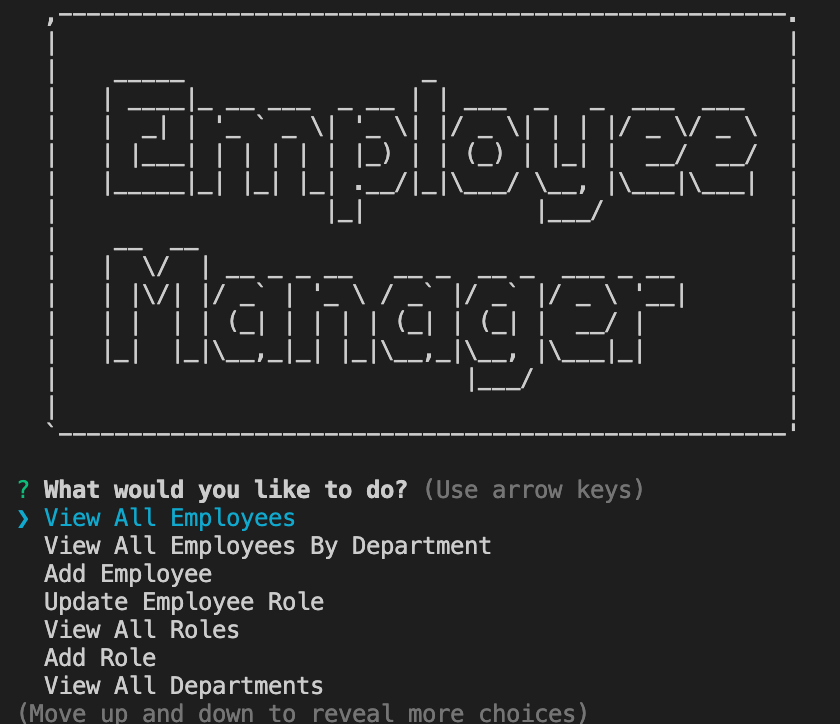

# Employee Tracker

## Description
An application that creates and displays a database of employees within a company. The database includes information regarding their name, role, salary, mananger, and department.

## Installation
In order to use the app users must install modules using:

    npm i

After information is added to the  mysql database, users can run the following command:

    node index.js 

## Images 

## Demo
https://youtu.be/cCUgrnKzF8U
